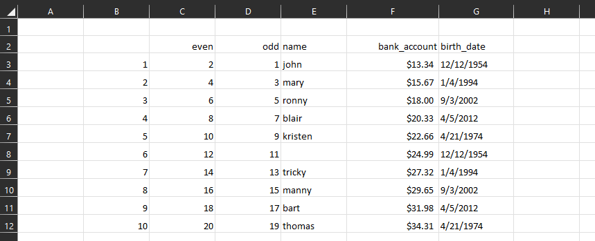

<center>
<i>A set of tools for working with data in spreadsheets and table formats</i>
</center>

<br>
<br>


# Install

```
pip install <URL>
```

<br>
<br>


# Usage



```python
import sheetutils as shu
from typing import Optional
from pydantic import BaseModel
from datetime import date, datetime


xlsx = shu.Workbook("./test/data/example-1.xlsx").load()

rng = xlsx.sheet("table").range("B2:G12")
class Row(BaseModel):
    even: int
    odd: int
    name: Optional[str]
    bank_account: float
    birth_date: datetime

tbl = shu.Table(Row).from_range(rng, 
                             skip_nulls=True, 
                             dynamic_col_headers=True,
                             include_sys_params=True)

print( tbl.to_dataframe() )
```

```
❯ python .\test.py
    even  odd     name  bank_account birth_date
0      2    1     john         13.34 1954-12-12
1      4    3     mary         15.67 1994-01-04
2      6    5    ronny         18.00 2002-09-03
3      8    7    blair         20.33 2012-04-05
4     10    9  kristen         22.66 1974-04-21
5     12   11     None         24.99 1954-12-12
6     14   13   tricky         27.32 1994-01-04
7     16   15    manny         29.65 2002-09-03
8     18   17     bart         31.98 2012-04-05
9     20   19   thomas         34.31 1974-04-21
```